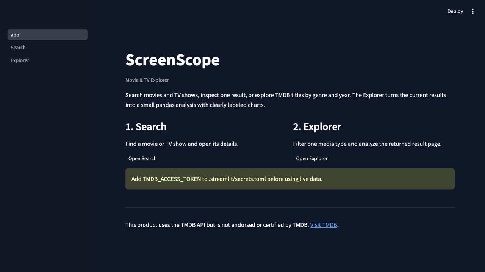
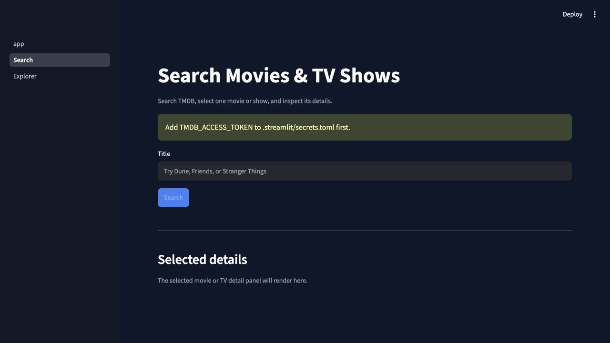
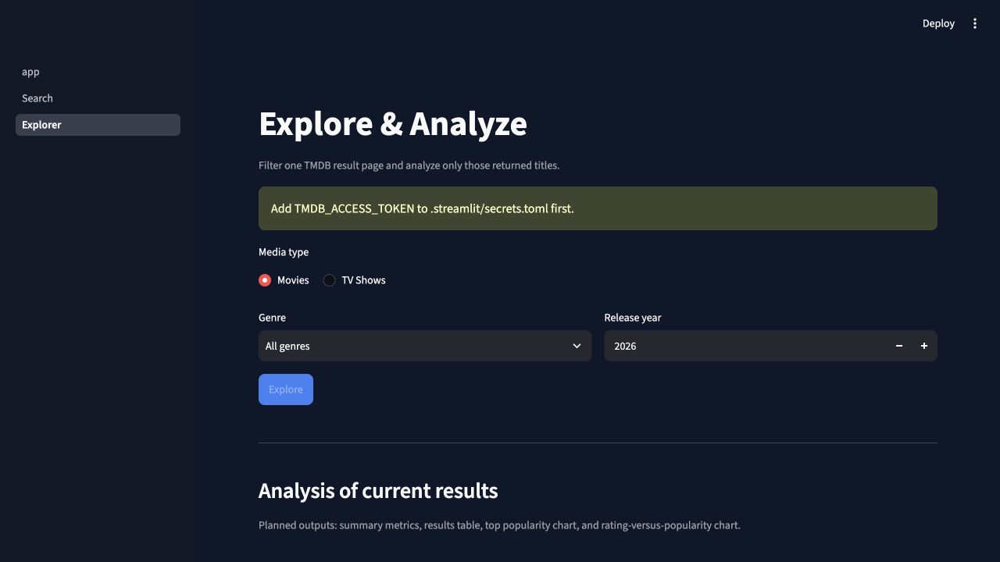

# ScreenScope

ScreenScope is a collaborative Python and Streamlit app for searching movies
and TV shows, viewing their details, and exploring popularity and rating
patterns with live data from the
[TMDB API](https://developer.themoviedb.org/docs/getting-started).

The graded MVP has only two user-facing pages:

1. **Search** - search movies and TV shows, choose a result, and view details.
2. **Explorer** - filter movies or TV shows by genre and release year, then
   analyze the returned ratings and popularity with pandas and charts.

## Current Scaffold Preview

These screenshots show the shared starting point. The layout may improve, but
the team should keep this same simple three-screen flow.

### Home



### Search



### Explorer



## Start Here

1. Complete the [local setup](#local-setup) and confirm the app opens.
2. Find your name in [Team TODOs](#team-todos).
3. Create the listed branch from the latest `main`.
4. Search your assigned files for `TODO` and complete only those items.
5. Run `pytest` and `streamlit run app.py`.
6. Commit, push, and open one pull request linked to your issue.

The dependency order is **API first**, then Search/Details and Explorer/Analysis,
then final integration. People can work in parallel using sample normalized
dictionaries while the API work is being completed.

## Course Requirements

| Requirement | ScreenScope implementation |
| --- | --- |
| Python web app | Python modules and two Streamlit pages |
| Data analysis | pandas analysis and Matplotlib charts over filtered TMDB results |
| API | TMDB search, details, genre, and discover endpoints |
| Hosted on Streamlit | Deploy `app.py` with Streamlit Community Cloud |
| Hosted on GitHub | Shared repository with commits and pull requests |
| Team access | All six members and the instructor added as collaborators |

## Deliberately Small MVP

### Tab 1: Search

- One search box using TMDB `/search/multi`
- Keep movie and TV results; ignore people
- Result cards with poster, title, media type, year, rating, and popularity
- A selected result displays its overview, genres, release date, rating, vote
  count, popularity, runtime, and status on the same page

### Tab 2: Explorer

- Choose `Movie` or `TV Show`
- Filter by one genre and one release/first-air year
- Use TMDB `/discover/movie` or `/discover/tv`, sorted by popularity
- Build one pandas DataFrame from the current result page
- Show summary metrics, a results table, and two charts:
  - top titles by popularity
  - rating versus popularity, with vote count available for context

The Explorer reports only on the current filtered TMDB result page. Labels
must say **"most popular in these results"**, not claim universal trending.

The MVP does **not** need TMDB account login, favorites, watchlists,
recommendations, machine learning, a database, episode analysis, or a second
API. The provided account-details documentation belongs to the same TMDB API,
but that endpoint is not required for this read-only app.

## Team TODOs

Each member should create a feature branch, make at least one meaningful
commit, and open one pull request. Confirm Debshree's GitHub username before
inviting collaborators.

### 1. Xianyu - TMDB API ([issue #2](https://github.com/AaryaDeshpande/ScreenScope-TV-Explorer/issues/2))

- **Branch:** `feature/tmdb-api`
- **Files:** `screenscope/api.py`, `screenscope/contracts.py`, `tests/test_api.py`
- Implement the four functions marked `TODO` in `screenscope/api.py`.
- Normalize every API response to the names in `screenscope/contracts.py`.
- Handle a bad token, timeout, HTTP error, empty result, and missing field.
- **Done when:** the four helpers work and API tests pass.

### 2. Debshree - Search ([issue #3](https://github.com/AaryaDeshpande/ScreenScope-TV-Explorer/issues/3))

- **Branch:** `feature/search-results`
- **Files:** `pages/1_Search.py`, `screenscope/search.py`
- Call `search_media()`, display movie/TV cards, and ignore person results.
- When a card is selected, store its `id` and `media_type` with
  `screenscope.state.set_selected_media()`.
- **Done when:** searching `Friends` shows selectable results without crashing
  on missing posters or ratings.

### 3. Yan - Selected Details ([issue #4](https://github.com/AaryaDeshpande/ScreenScope-TV-Explorer/issues/4))

- **Branch:** `feature/media-details`
- **Files:** `screenscope/details.py`, `screenscope/detail_view.py`
- Convert a normalized detail dictionary into safe display fields.
- Render poster, title, overview, genres, date, rating, popularity, runtime, and
  status. Use friendly fallbacks such as `Not available`.
- **Done when:** selecting either a movie or TV show displays its details below
  the Search results.

### 4. Snehal - Explorer and Deployment ([issue #6](https://github.com/AaryaDeshpande/ScreenScope-TV-Explorer/issues/6))

- **Branch:** `feature/explorer-deploy`
- **Files:** `pages/2_Explorer.py`, `screenscope/explore.py`, `docs/DEPLOYMENT.md`
- Load genres, map the Movie/TV choice, and call `discover_media()` with the
  selected genre and year.
- Pass the returned results to Kuba's analysis helpers.
- Complete the deployment and QA checklist.
- **Done when:** both Movie and TV filters return data and the public Streamlit
  URL opens.

### 5. Kuba - pandas Analysis ([issue #5](https://github.com/AaryaDeshpande/ScreenScope-TV-Explorer/issues/5))

- **Branch:** `feature/explorer-analysis`
- **Files:** `screenscope/analysis.py`, `tests/test_analysis.py`
- Calculate result count, mean rating, and mean popularity.
- Prepare one top-popularity bar chart and one rating-versus-popularity scatter
  chart. Do not treat missing ratings as zero.
- **Done when:** Explorer displays metrics, a table, and two labeled charts.

### 6. Aarya - Integration and Visual Consistency ([issue #1](https://github.com/AaryaDeshpande/ScreenScope-TV-Explorer/issues/1))

- **Branch:** `feature/app-integration`
- **Files:** `app.py`, `screenscope/styles.py`, shared documentation
- Review and integrate the five feature pull requests.
- Keep Home, Search, and Explorer visually consistent and responsive.
- Verify attribution, error states, tests, README, and final demo flow.
- **Done when:** a new visitor can complete both user flows on the deployed app.

Assignments reduce merge conflicts; they are not walls. Teammates should
review one another's pull requests and coordinate before changing a shared
function signature.

## Shared Media Contract

Feature modules exchange normalized dictionaries or DataFrames using the
fields in `screenscope/contracts.py`:

```text
id, media_type, title, original_title, release_date, release_year,
genre_ids, genre_names, overview, poster_url, backdrop_url, rating,
vote_count, popularity, original_language
```

The detail response may also include:

```text
runtime, status, tagline, homepage
```

Keep this contract small. Do not add cast, trailers, accounts, watchlists, or
recommendations unless the required app is already deployed and stable.

## Repository Structure

```text
.
|-- app.py                         # Shared Streamlit entry point
|-- pages/
|   |-- 1_Search.py                # Search, results, and selected details
|   `-- 2_Explorer.py              # Filters and data-analysis view
|-- screenscope/
|   |-- api.py                     # TMDB HTTP client and endpoints
|   |-- config.py                  # Local/Streamlit token loading
|   |-- contracts.py               # Shared normalized field names
|   |-- search.py                  # Search-card transformations
|   |-- details.py                 # Detail transformations
|   |-- detail_view.py             # Reusable Streamlit detail renderer
|   |-- analysis.py                # pandas analysis and chart data
|   |-- explore.py                 # Explorer query helpers
|   |-- state.py                   # Selected media state
|   `-- styles.py                  # Shared visual tokens and CSS
|-- tests/
|-- docs/
|-- requirements.txt
`-- CONTRIBUTING.md
```

## Local Setup

The course standard is Python 3.10.

```bash
git clone https://github.com/AaryaDeshpande/ScreenScope-TV-Explorer.git
cd ScreenScope-TV-Explorer
python3.10 -m venv .venv
source .venv/bin/activate
python -m pip install -r requirements.txt
cp .streamlit/secrets.toml.example .streamlit/secrets.toml
streamlit run app.py
```

Add the TMDB **API Read Access Token** to your local
`.streamlit/secrets.toml`:

```toml
TMDB_ACCESS_TOKEN = "paste-your-read-access-token-here"
```

The real secrets file is ignored by Git. Add the same secret in Streamlit
Community Cloud when deploying. Never commit a token, API key, or session ID.

## Collaboration Workflow

Read [CONTRIBUTING.md](CONTRIBUTING.md) before editing. In short:

1. Pull the latest `main`.
2. Create your assigned feature branch from `main`.
3. Work mainly in your assigned files.
4. Run the app and tests.
5. Commit with a descriptive message and push your branch.
6. Open a pull request to `main` and request a teammate review.
7. Merge only after the app starts and there are no unresolved conflicts.

Useful commands for every teammate:

```bash
git switch main
git pull origin main
git switch -c your-branch-name
# edit only your assigned files
pytest
git add path/to/your_file.py
git commit -m "Describe your feature"
git push -u origin your-branch-name
```

## Design Direction

The source of truth is [docs/DESIGN.md](docs/DESIGN.md). Use the dark
ScreenScope concept: compact navigation, prominent search, responsive poster
cards, restrained blue actions, warm rating accents, and readable charts. All
runtime titles, posters, and metrics must come from TMDB rather than hard-coded
prototype examples.

## Submission Checklist

- [ ] All six students are GitHub collaborators.
- [ ] Instructor `babbages` is invited to the repository.
- [ ] Every member has at least one meaningful commit and pull request.
- [ ] Live TMDB search and discover data appear in the app.
- [ ] pandas-based analysis and two charts are visible.
- [ ] App is deployed publicly with Streamlit.
- [ ] TMDB is visibly credited with the required notice.
- [ ] Empty results, missing posters, missing ratings, and API failures are handled.
- [ ] No secrets are committed.
- [ ] `pytest` passes and the final demo is recorded.

## TMDB Attribution

This product uses the TMDB API but is not endorsed or certified by TMDB.

ScreenScope must include an About/Credits area with an approved TMDB logo and a
link to [The Movie Database](https://www.themoviedb.org/). TMDB branding must
remain less prominent than the ScreenScope identity.
