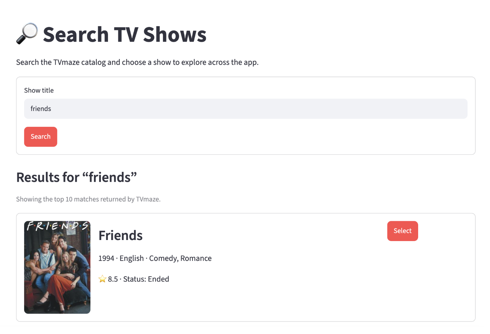

# ScreenScope Design Direction

## Chosen Reference

Use the dark **ScreenScope** concept in `docs/reference/` as the visual source of
truth for layout and hierarchy:

- Compact top identity area, not a marketing landing page
- Dark navy application background
- Restrained blue primary actions
- Warm gold for ratings
- Coral and teal only for meaningful status or chart accents
- Prominent search control
- Stable, responsive poster-card grid
- Focused details layout with a clear return path
- Analysis presented as charts and tables, not decorative metrics

The lighter TVmaze prototype is a **content and interaction reference**: it
demonstrates real search results, useful show fields, and selection behavior.
It is not the final visual direction.

### Search and Card Grid

### Selected Show Details

### Real TVmaze Search Content

## TVmaze Adaptation

The concept screenshots contain movie and TMDB-specific labels. Do not reproduce
those labels. ScreenScope must use TVmaze television fields and attribution:

- "TVmaze rating," not "TMDB rating"
- Show premiere date, not movie release date
- Network or web channel, not movie popularity
- Episode analysis rather than movie analytics

## Layout Targets

### Search

- Search control at the top of the working area
- Two to four cards per row depending on viewport width
- Each card has a stable poster ratio and metadata area
- Missing posters use a restrained text fallback without resizing the card

### Details

- Poster and show metadata share the first viewport
- Summary and cast remain readable without nested cards
- Back navigation returns to existing search results

### Analysis

- KPI row followed by charts and a supporting episode table
- Chart titles state exactly which records are being analyzed
- Missing ratings are excluded and counted, not silently converted to zero

## Accessibility and Responsiveness

- Maintain readable contrast on the navy background.
- Never communicate rating or status through color alone.
- Keep buttons and filter labels visible on mobile.
- Avoid fixed widths that force horizontal scrolling.
- Provide text for missing images and empty results.
