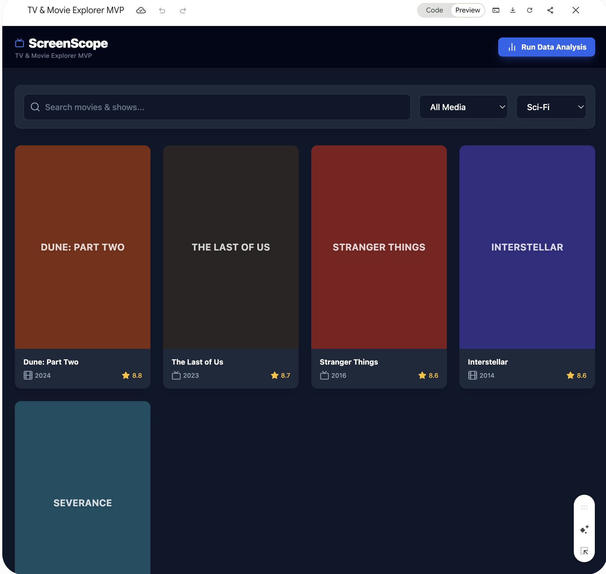
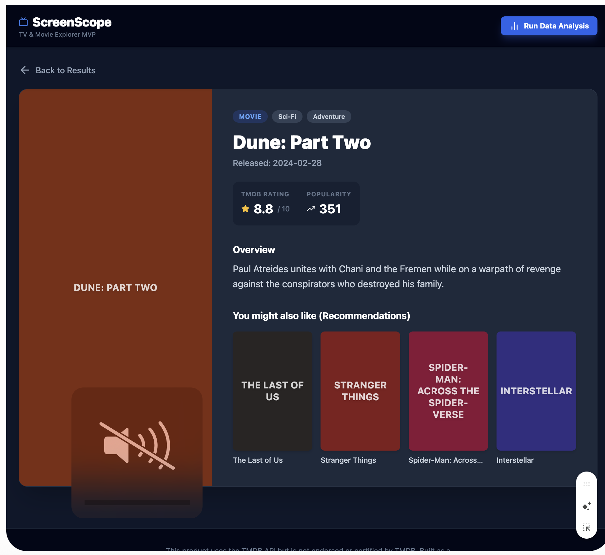

# ScreenScope Design Direction

## Chosen Reference

Use the dark **ScreenScope** concepts in `docs/reference/` as the visual source
of truth for layout and hierarchy:

- Compact identity and navigation, not a marketing landing page
- Dark navy application background
- Restrained blue primary actions
- Warm gold for ratings
- Coral and teal only for meaningful chart accents
- Prominent search control
- Stable, responsive poster-card grid
- Focused detail section below the selected search result
- Analysis presented as charts and tables, not decorative metrics

### Search and Card Grid

### Selected Media Details

The concepts already contain movie and TMDB-style fields, but their records are
mock data. Runtime content must come from TMDB.

## Two-Page Layout

### Search

- Search control at the top of the working area
- Two to four cards per row depending on viewport width
- Each card has a stable 2:3 poster ratio and metadata area
- Missing posters use a restrained text fallback without resizing the card
- Selecting a card reveals the detail section on the same page

### Explorer

- Media type, genre, and year controls stay together above the results
- KPI row is followed by two charts and a supporting table
- Chart titles state exactly which filtered records are being analyzed
- Avoid a separate "Run Data Analysis" page or button; analysis updates from
  the Explorer result set

## Accessibility and Responsiveness

- Maintain readable contrast on the navy background.
- Never communicate rating or media type through color alone.
- Keep buttons and filters visible on mobile.
- Avoid fixed widths that force horizontal scrolling.
- Provide text for missing posters and empty results.

## Attribution

Include a small About/Credits area with an approved TMDB logo, a link to TMDB,
and this exact notice:

> This product uses the TMDB API but is not endorsed or certified by TMDB.

The ScreenScope identity must remain more prominent than TMDB branding.
